# Three-Tier Web Application | S3 + CloudFront + Lambda + API Gateway + DynamoDB

---

## Table of Contents

* [Introduction](#introduction)
* [Architecture Overview](#architecture-overview)
* [Prerequisites](#prerequisites)
* [Part 1: Presentation Tier — S3 + CloudFront](#part-1-presentation-tier--s3--cloudfront)
  * [1. Create an S3 Bucket](#1-create-an-s3-bucket)
  * [2. Upload Website Files](#2-upload-website-files)
  * [3. Create a CloudFront Distribution](#3-create-a-cloudfront-distribution)
  * [4. Update S3 Bucket Policy](#4-update-s3-bucket-policy)
  * [5. Verify CloudFront Distribution](#5-verify-cloudfront-distribution)
* [Part 2: Logic Tier — Lambda + API Gateway](#part-2-logic-tier--lambda--api-gateway)
  * [1. Create a Lambda Function](#1-create-a-lambda-function)
  * [2. Write Lambda Function Code](#2-write-lambda-function-code)
  * [3. Create the API Gateway](#3-create-the-api-gateway)
  * [4. Create a Resource and Method](#4-create-a-resource-and-method)
  * [5. Deploy the API](#5-deploy-the-api)
* [Part 3: Data Tier — DynamoDB](#part-3-data-tier--dynamodb)
  * [1. Create a DynamoDB Table](#1-create-a-dynamodb-table)
  * [2. Add a Table Item](#2-add-a-table-item)
  * [3. Grant Lambda Access to DynamoDB](#3-grant-lambda-access-to-dynamodb)
* [Part 4: Integrate the Tiers](#part-4-integrate-the-tiers)
  * [1. Verify API Returns Data](#1-verify-api-returns-data)
  * [2. Update script.js With the API URL](#2-update-scriptjs-with-the-api-url)
  * [3. Re-upload script.js to S3](#3-re-upload-scriptjs-to-s3)
* [Part 5: Fix CORS and Final Verification](#part-5-fix-cors-and-final-verification)
  * [1. Enable CORS on API Gateway](#1-enable-cors-on-api-gateway)
  * [2. Add CORS Headers to Lambda](#2-add-cors-headers-to-lambda)
  * [3. Redeploy the API](#3-redeploy-the-api)
  * [4. Final Verification](#4-final-verification)
* [Teardown](#teardown)

---

# Introduction

This project builds a three-tier web application on AWS using serverless services. No servers to manage — everything scales automatically.

**The three tiers:**

- **Presentation** — Static website files (HTML, CSS, JS) stored in S3 and distributed globally via CloudFront
- **Logic** — A Lambda function that fetches user data, exposed via API Gateway
- **Data** — A DynamoDB table storing user records

**Flow:**

```
User → CloudFront → S3 (static files)
User clicks "Get User Data" → API Gateway → Lambda → DynamoDB → response back to browser
```

---

# Architecture Overview


---

# Prerequisites

- An AWS account
- A text editor (VS Code recommended)
- Basic familiarity with the AWS console

---

# Part 1: Presentation Tier — S3 + CloudFront

The presentation tier handles everything the user sees. Website files live in S3 and get delivered globally through CloudFront.

## 1. Create an S3 Bucket

1. Go to **S3** → **Create bucket**
2. **Bucket name:** use a unique name e.g. `three-tier-web-app-<your-name>`

   > S3 bucket names are globally unique — if a name is taken, add more characters to make it unique.

3. Leave all other settings as default
4. Click **Create bucket**

## 2. Upload Website Files

Download these three files:
- `index.html` — the main webpage
- `style.css` — the visual styling
- `script.js` — handles the API call to fetch user data

1. Click into your bucket
2. Click **Upload** → **Add files**
3. Select all three downloaded files
4. Click **Upload**

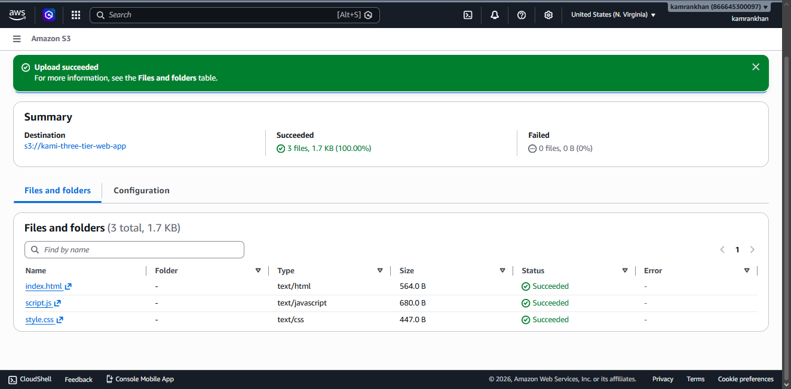

## 3. Create a CloudFront Distribution

CloudFront caches your content at edge locations worldwide so users get faster load times regardless of where they are.

1. Go to **CloudFront** → **Create distribution**
2. **Distribution name:** e.g. `three-tier-web-app`
3. **Distribution type:** Single website or app
4. Click **Next**

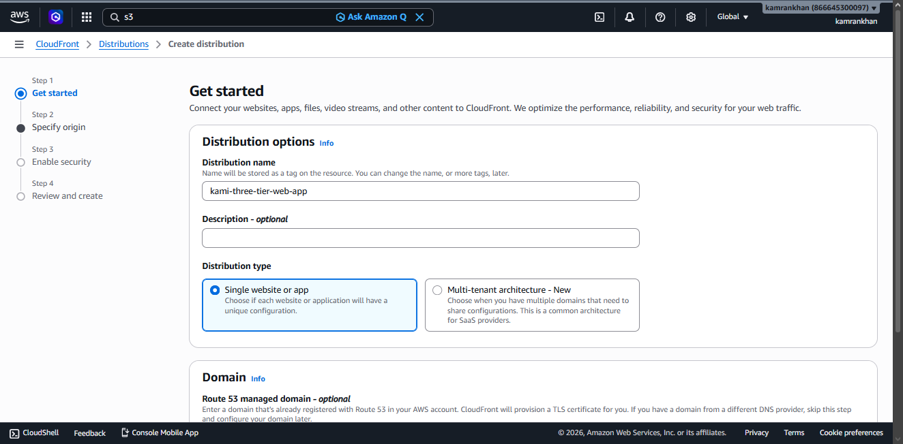

5. In the **Origin** panel, click **Browse S3** and select your bucket

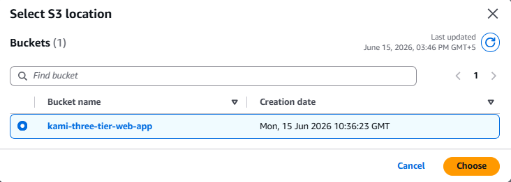

6. **WAF:** select **Do not enable security protections**
7. Review and click **Create distribution**

> Wait a few minutes for the distribution to deploy — status will change from **Deploying** to a timestamp.

## 4. Update S3 Bucket Policy

CloudFront needs read access to your private S3 bucket.

1. In your CloudFront distribution settings, click **Copy policy**
2. Click the shortcut link to go directly to your S3 bucket's **Permissions** tab
3. Scroll to **Bucket policy** → **Edit**
4. Paste the copied policy
5. Click **Save changes**

## 5. Verify CloudFront Distribution

1. Copy the **Distribution domain name** from your CloudFront distribution
2. Paste it in your browser

You should see the User Information webpage.

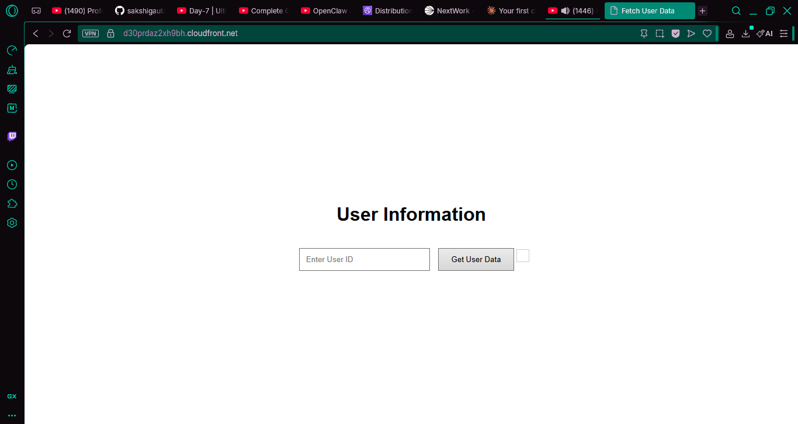

---

# Part 2: Logic Tier — Lambda + API Gateway

The logic tier handles requests from the frontend and fetches data from the database.

## 1. Create a Lambda Function

1. Go to **Lambda** → **Create function**
2. Select **Author from scratch**
3. **Function name:** `RetrieveUserData`
4. **Runtime:** Node.js (latest)
5. **Architecture:** x86_64
6. Click **Create function**

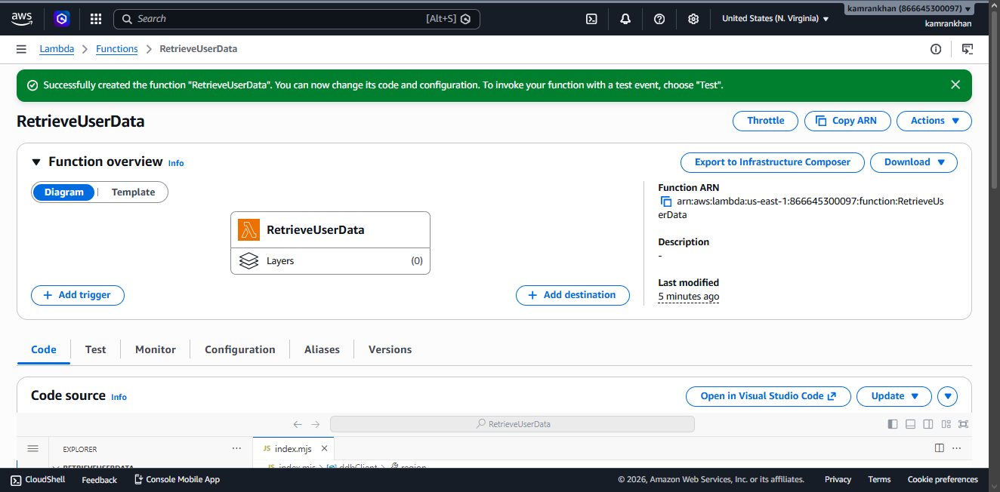

## 2. Write Lambda Function Code

In the **Code source** panel, replace the default code with:

```javascript
import { DynamoDBClient } from "@aws-sdk/client-dynamodb";
import { DynamoDBDocumentClient, GetCommand } from "@aws-sdk/lib-dynamodb";

const ddbClient = new DynamoDBClient({ region: 'YOUR_REGION' });
const ddb = DynamoDBDocumentClient.from(ddbClient);

async function handler(event) {
    const userId = event.queryStringParameters.userId;
    const params = {
        TableName: 'UserData',
        Key: { userId }
    };

    try {
        const command = new GetCommand(params);
        const { Item } = await ddb.send(command);
        if (Item) {
            return {
                statusCode: 200,
                body: JSON.stringify(Item),
                headers: {'Content-Type': 'application/json'}
            };
        } else {
            return {
                statusCode: 404,
                body: JSON.stringify({ message: "No user data found" }),
                headers: {'Content-Type': 'application/json'}
            };
        }
    } catch (err) {
        console.error("Unable to retrieve data:", err);
        return {
            statusCode: 500,
            body: JSON.stringify({ message: "Failed to retrieve user data" }),
            headers: {'Content-Type': 'application/json'}
        };
    }
}

export { handler };
```

> Replace `YOUR_REGION` with your actual AWS region code e.g. `us-east-1`

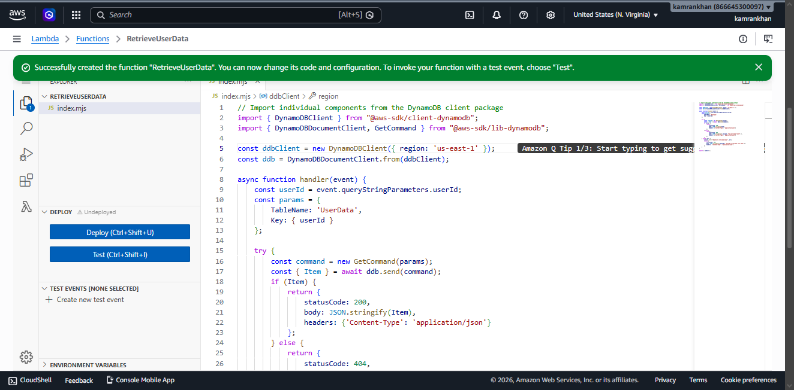

Click **Deploy**.

## 3. Create the API Gateway

API Gateway is the front door to your Lambda function — it receives HTTP requests and routes them to Lambda.

1. Go to **API Gateway** → scroll to **REST API** → **Build**
2. Select **New API**
3. **API name:** `UserRequestAPI`
4. **Endpoint type:** Regional
5. Click **Create API**

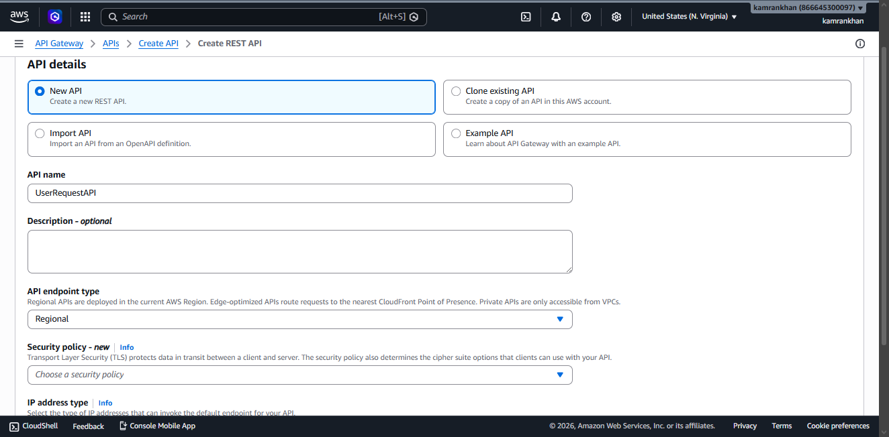

## 4. Create a Resource and Method

**Create the resource:**

1. Under **Resources**, click **Create resource**
2. **Resource name:** `users`
3. Click **Create resource**

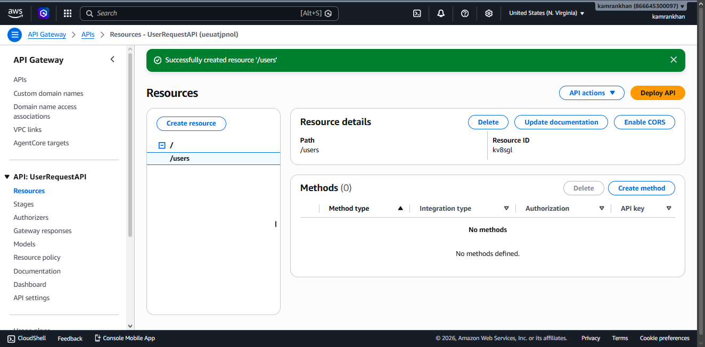

**Create the method:**

1. Select the `/users` resource
2. Click **Create method**
3. **Method type:** GET
4. **Integration type:** Lambda Function
5. Toggle on **Lambda proxy integration**
6. Select your region and choose `RetrieveUserData` from the dropdown
7. Click **Create method**

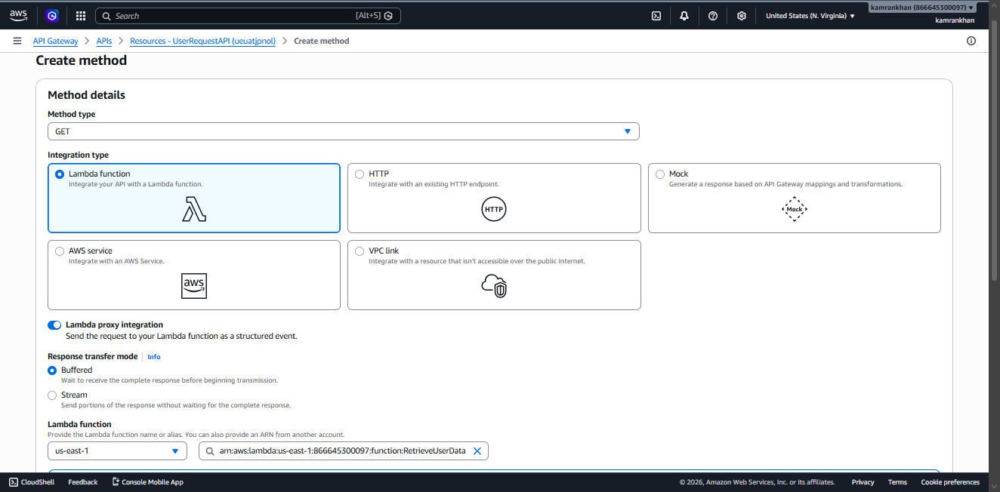

## 5. Deploy the API

1. Click **Deploy API**
2. **Stage:** New stage → name it `prod`
3. Click **Deploy**

Copy the **Invoke URL** — you'll need it in Part 4.

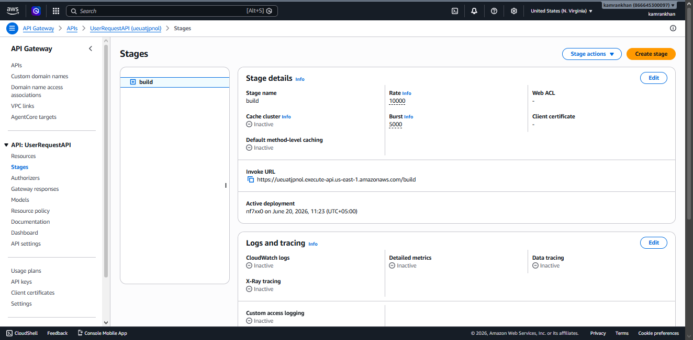

---

# Part 3: Data Tier — DynamoDB

The data tier stores your user records. DynamoDB is a NoSQL database — no fixed schema, scales automatically.

## 1. Create a DynamoDB Table

1. Go to **DynamoDB** → **Tables** → **Create table**
2. **Table name:** `UserData`
3. **Partition key:** `userId` (String)
4. Leave default settings
5. Click **Create table** — wait for status **Active**

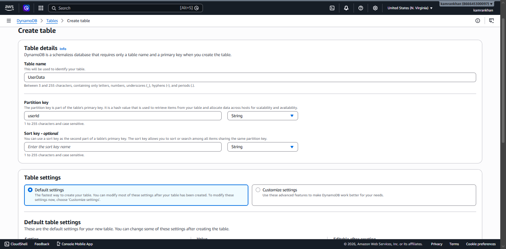

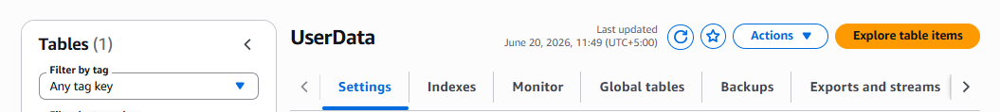

## 2. Add a Table Item

1. Click into the `UserData` table → **Explore table items**
2. Click **Create item**
3. Switch to **JSON view** and turn off **View DynamoDB JSON**
4. Paste:

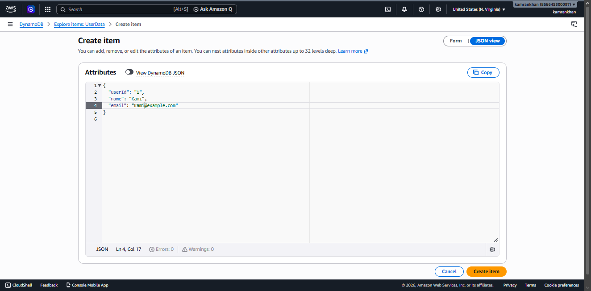

```json
{
  "userId": "1",
  "name": "Kami",
  "email": "Kami@example.com"
}
```

5. Click **Create item**

Before adding:


After adding:

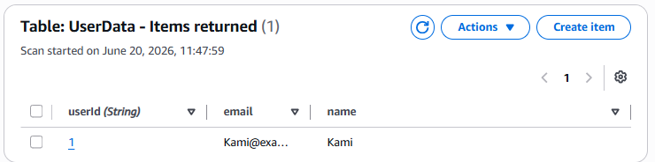

## 3. Grant Lambda Access to DynamoDB

Lambda needs permission to read from DynamoDB.

1. Go to your Lambda function → **Configuration** tab → **Permissions**
2. Click the execution role name (e.g. `RetrieveUserData-role-xxxxxxxx`)

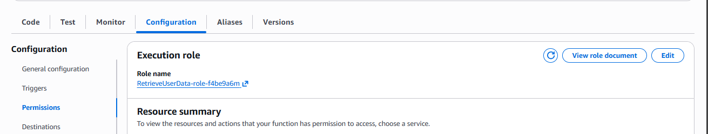

3. In IAM, click **Add permissions** → **Attach policies**
4. Search for `DynamoDB` → select **AmazonDynamoDBReadOnlyAccess**
5. Click **Add permissions**

---

# Part 4: Integrate the Tiers

Now connect all three layers — the website needs to know your API's URL to fetch data.

## 1. Verify API Returns Data

Test that your API and database are working together before updating the frontend.

1. Take your API **Invoke URL** and append `/users?userId=1`
2. Open it in a browser

You should see the user data returned as JSON:

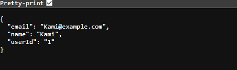

## 2. Update script.js With the API URL

The frontend can't fetch data yet because `script.js` still has a placeholder URL. Open `script.js` in VS Code and replace `[YOUR-PROD-API-URL]` on line 9 with your real Invoke URL:

```javascript
const response = await fetch(`https://<your-invoke-url>/prod/users?userId=${userId}`);
```

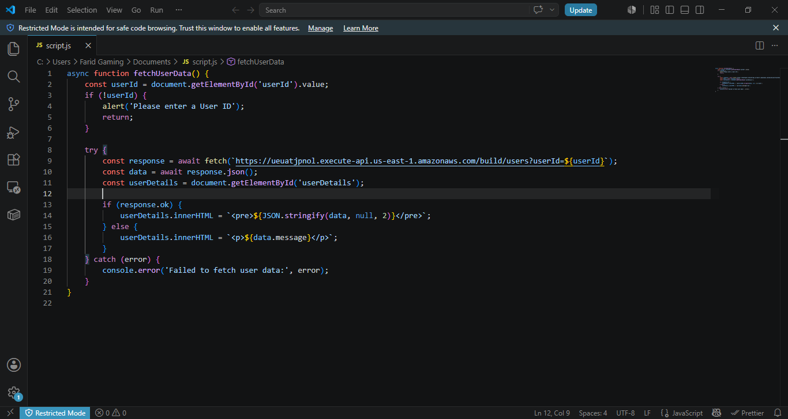

## 3. Re-upload script.js to S3

1. Go to **S3** → your bucket
2. Click **Upload** → **Add files**
3. Select the updated `script.js`
4. Click **Upload**

---

# Part 5: Fix CORS and Final Verification

The website will still fail with a CORS error — the browser blocks requests from your CloudFront domain to the API Gateway URL because API Gateway hasn't given CloudFront permission yet.

## 1. Enable CORS on API Gateway

1. Go to **API Gateway** → **Resources** → select `/users`
2. Click **Enable CORS**
3. Check both **GET** and **OPTIONS** under Access-Control-Allow-Methods
4. Set **Access-Control-Allow-Origin** to your CloudFront distribution domain name
5. Click **Save**

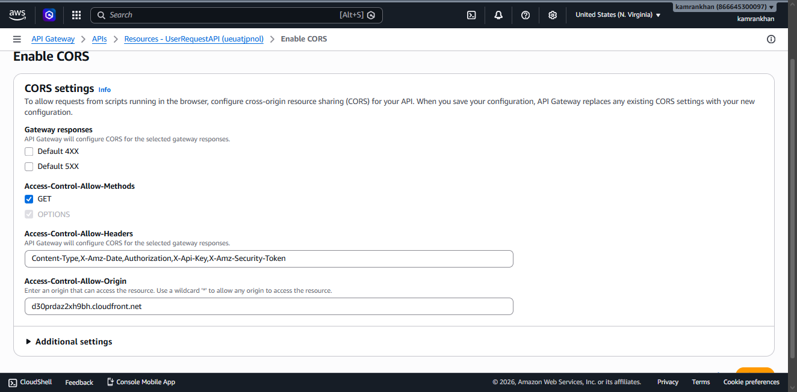

## 2. Add CORS Headers to Lambda

Because Lambda proxy integration is enabled, CORS headers must be added inside the Lambda response — API Gateway won't add them automatically.

Update your Lambda function code to include CORS headers in every response:

```javascript
import { DynamoDBClient } from "@aws-sdk/client-dynamodb";
import { DynamoDBDocumentClient, GetCommand } from "@aws-sdk/lib-dynamodb";

const ddbClient = new DynamoDBClient({ region: 'YOUR_REGION' });
const ddb = DynamoDBDocumentClient.from(ddbClient);

async function handler(event) {
    const userId = event.queryStringParameters.userId;
    const params = {
        TableName: 'UserData',
        Key: { userId }
    };

    try {
        const command = new GetCommand(params);
        const { Item } = await ddb.send(command);

        if (Item) {
            return {
                statusCode: 200,
                headers: {
                    'Content-Type': 'application/json',
                    'Access-Control-Allow-Origin': 'https://<your-cloudfront-domain>'
                },
                body: JSON.stringify(Item)
            };
        } else {
            return {
                statusCode: 404,
                headers: {
                    'Content-Type': 'application/json',
                    'Access-Control-Allow-Origin': 'https://<your-cloudfront-domain>'
                },
                body: JSON.stringify({ message: "No user data found" })
            };
        }
    } catch (err) {
        console.error("Unable to retrieve data:", err);
        return {
            statusCode: 500,
            headers: {
                'Content-Type': 'application/json',
                'Access-Control-Allow-Origin': 'https://<your-cloudfront-domain>'
            },
            body: JSON.stringify({ message: "Failed to retrieve user data" })
        };
    }
}

export { handler };
```

> Replace `YOUR_REGION` and `<your-cloudfront-domain>` with your actual values. Avoid using `*` for the Allow-Origin in production — restrict it to your CloudFront domain only.

Click **Deploy**.

## 3. Redeploy the API

CORS changes don't take effect until you redeploy:

1. Click **Deploy API**
2. Select the `prod` stage
3. Click **Deploy**

## 4. Final Verification

Open your CloudFront domain in the browser. Enter `1` in the User ID field and click **Get User Data**.


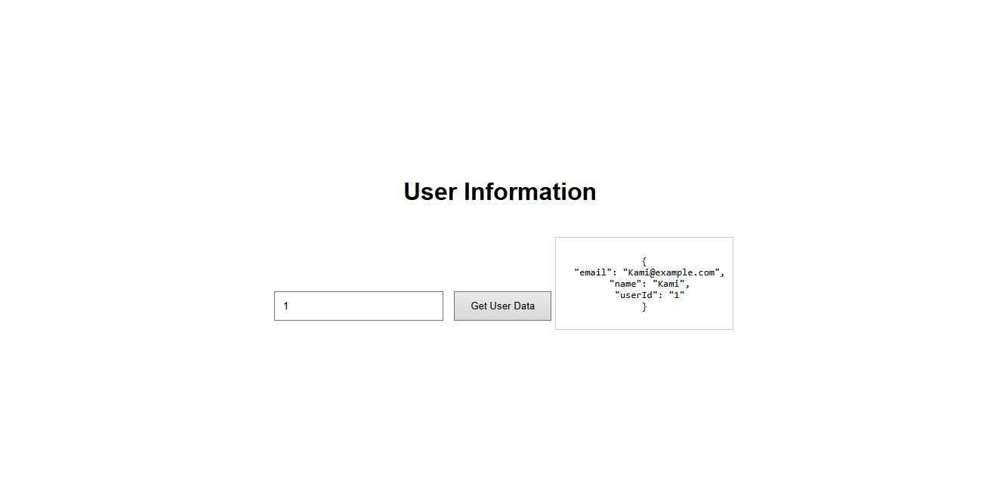

All three tiers are now connected and working end to end. ✅

---

# Teardown

Delete resources in this order — CloudFront must be deleted before S3.

**1. CloudFront Distribution**

CloudFront → select your distribution → **Disable** → wait for status to update → **Delete**.

**2. S3 Bucket**

S3 → select your bucket → **Empty** → confirm → **Delete** → confirm.

**3. API Gateway**

API Gateway → select `UserRequestAPI` → **Actions** → **Delete API** → confirm.

**4. Lambda Function**

Lambda → select `RetrieveUserData` → **Actions** → **Delete** → confirm.

**5. DynamoDB Table**

DynamoDB → **Tables** → select `UserData` → **Delete** → uncheck backup option → type `confirm` → **Delete**.
